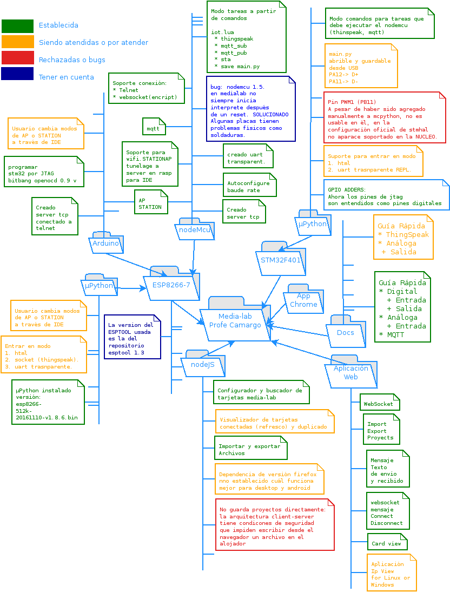

# AppNode #


AppNode es un conjunto de software tanto para la tarjeta de desarrollo MediaLab como para la interfaz 
de usuario que permite su programación, AppNode se desarrolla con el fin de darle la facilidad al usuario
de una programación sin preocuparse de la sintaxis a partir de bloques gráficos que representan funciones
posibles por la tarjeta como es el caso de Internet de las cosas. La principal característica de AppNode
es que se ejecuta como una aplicación al lado del servidor, que en el caso de una aula de clase puede
ser prestado por una raspberry pi de ejemplo.

# MediaLab #


MediLab es una tarjeta electrónica de desarrollo programable, la cual permite el uso
de sensores y actuadores como lo haría un Arduino o cualquier otra plataforma de desarrollo
con la ventaja de separar las tareas de comunicación y control de hardware a través de 
microcontroladores diferentes.


# Documentación #

[media_lab](http://docsmedialab.readthedocs.io/es/latest/index.html)

# Instalación de blocklyMicropython #

Se decide hacer uso de git para la instalación debido a que por el
control de versiones de proyectos bastaría con solo hacer uso de un pull


##	Dependencias a cumplir ##

**Nota** Los comandos que empiezan con almuadilla (#) hacen referencia
a que deben ser ejecutados con permisos de SUPERUSUARIO (Administrador)
o haciendo uso de *SUDO*, mientras que los que empiezan con el signo $
no lo requieren.

1. Antes de instalar, actualizar source list de los repositorios.

```
# apt-get update
```

2. Los programas a instalar son:

* git
* telnet
* nmap
* mosquitto

Instalación desde repositorios:
```
# apt-get install git telnet nmap expect mosquitto
```

## Clonación del repositorio appNode #

Para clonar el repositorio basta con ejecutar el siguiente comando:

```
$ cd ~/
$ git clone https://bitbucket.org/pinguinotux/appnode.git
```

## Instalación de nodeJS: Enlaces simbólicos ##

En este directorio se encontrará una versión de node *node-v6.3.1-linux-armv7l* 
la cual funciona adecuadamente. Solo es necesario crear los enlaces simbólicos 
de **node** y **npm**.

### Enlace simbólico para node ###

```
$ cd ~/appnode/node-v6.3.1-linux-armv7l/bin/
# ln -s `pwd`/node /usr/bin/node
```

### Enlace simbólico para npm ###

```
$ cd ~/appnode/node-v6.3.1-linux-armv7l/bin/
# ln -s `pwd`/npm /usr/bin/npm
```

# RUN blocklyMicropython #

Teniendo en cuenta el uso de sockets por parte de nodeJS, se debe 
configurar la conexión cliente servidor.

Para lograrlo basta con conocer la siguiente información:

1. Dirección IP del enrutador (puerta de enlace) de la conexión WIFI
 (Se menciona de esta manera debido a que la raspberry puede ser punto de acceso o simple estación)

2. Dirección IP del servidor (La dirección de la rasp).


**Importante**: Lanzar la aplicación se puede hacer de dos maneras: 

* Manualmente:
```
$ cd ~/appnode
$ node server/servidor.js
```
* O como un servicio que se lanza desde el arranque del S.O. 

De ambas maneras, se debe configurar las siguientes variables para tener
éxito en la conexión:

* **Configuración del servidor.**

En 
```
nano ~/appnode/server/servidor.js				// Si desea un lazamiento manual
```
y/o
```
nano ~/appnode/server/servidor_service.js		// Si desea un lanzamiento automático
```

Cambiar el valor de las siguientes variables por las ya conocidas.

```
var hostname = '192.168.2.1';   				// Dirección servidor node (web)
```

```
var route_ip = '192.168.2.1';   				// Dirección del enrutador para comando nmap
```

* **Configuración del cliente**

En:

```
nano appnode/public/config/dependencies/cliente.js
```

Cambiar el valor de la siguiente variable por la ya conocida.

```
var hostname = '192.168.2.1';					// Dirección servidor node (web)
```

## RUN blocklyMicropython desde el arranque del sistema operativo ##

Como se mencionó se pude hacer que el servicio sea lanzado desde el arranque
del sistema operativo. Para tal fin copiar el archivo *blocklyMicropython* en
el directorio */etc/init.d* como sigue:

```
# cp ~/appnode/blocklyMicropython /etc/init.d/
```

Ahora es necesario dar permisos de ejecuación

```
# chmod +x /etc/init.d/blocklyMicropython
```

Finalmente se debe habilitar el servicio para que se inicie con el boot

```
# update-rc.d blocklyMicropython defaults
```

Puede reiniciar la raspberry con el siguiente comando.

```
# shutdown -r now
```

Cuando se haya iniciado el S.O. puede comprobar que se está ejecutando el servicio:

```
# service blocklyMicropython status
```

Puede detener el servicio

```
service blocklyMicropython stop
```

Puede reiniciarlo manualmente

```
# service blocklyMicropython start
```

Cuando se tenga un cliente conectado a la raspberry (por conexión wifi)
puede comprobar la aplicación accediendo a ella desde el navegador *firefox*
escribiendo en el buscador la dirección del servicio junto al puerto por el cual "escucha".

```
ip_hostname:1522
```

Ejemplo:

```
192.168.2.1:1522
```

# En desarrollo #



Atentamente:

Carolina Pulido crpulidog@unal.edu.co

Johnny Cubides  jgcubidesc@unal.edu.co

Universidad Nacional de Colombia
