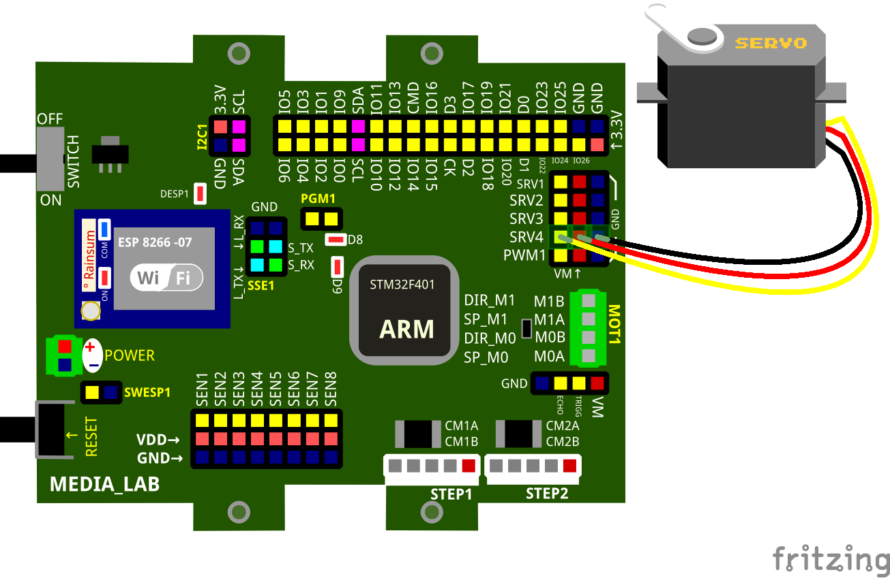

Manejo de ServoMotores
======================

.. code:: python

        import pyb
        class servomotor:
        def __init__(self, pin):
            timer = pyb.Timer(4, freq=200)
            self.ch = timer.channel(5-pin, pyb.Timer.PWM, pin=pyb.Pin('SRV'+str(pin)))
        def angulo(self,x):
            if 0 <= x and x <= 180:
                self.ch.pulse_width(4800+int(x*15600/180))
